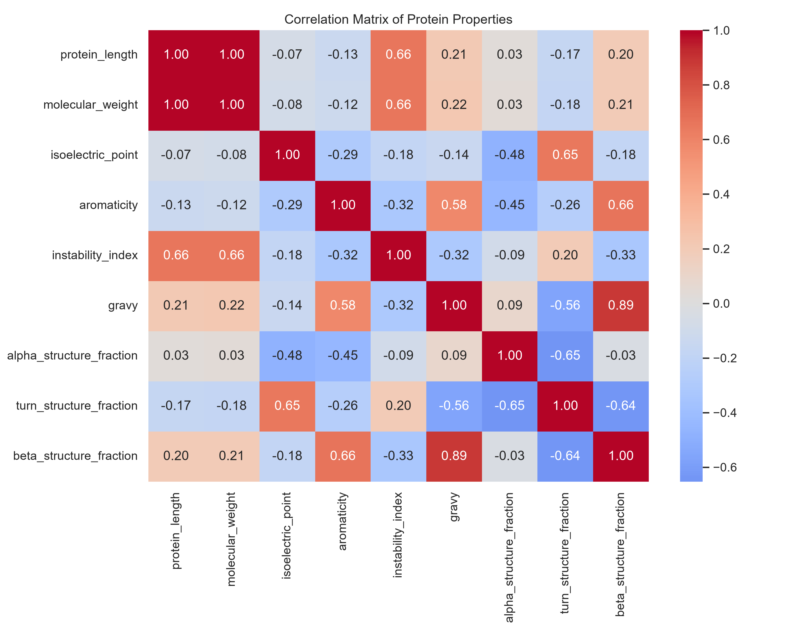

<a name="readme-top"></a>

# NeuroProtein Analyzer

A Python based bioinformatics pipeline for exploring sequence derived properties of neurodegenerative disease proteins and comparing them against housekeeping control proteins.

## About The Project

NeuroProtein Analyzer automates the retrieval and analysis of protein sequences associated with major neurodegenerative disorders.

Using Biopython's Entrez and ProtParam modules, the pipeline fetches protein sequences from NCBI, extracts physicochemical and structural features and generates visualizations for exploratory analysis.

The project focuses on five disease associated proteins:

* APP (Amyloid Precursor Protein)
* MAPT (Tau)
* SNCA (Alpha-Synuclein)
* HTT (Huntingtin)
* TARDBP (TDP-43)

and compares them against a curated panel of housekeeping control proteins.

### Built With

* Python
* Biopython
* Pandas
* Matplotlib
* Seaborn
* NCBI Entrez

## Features

* Automated protein sequence retrieval from NCBI
* Physicochemical property analysis using ProtParam
* Disease vs control protein comparison
* Amino acid composition analysis
* Correlation analysis of protein properties
* Automated table generation
* Exploratory data visualizations

## Workflow

```text
Gene Panel
    ↓
NCBI Sequence Retrieval
    ↓
Protein Sequences
    ↓
ProtParam Analysis
    ↓
Feature Extraction
    ↓
Summary Tables
    ↓
Visualizations
```

## Project Structure

```text
NeuroProtein-Analyzer
│
├── data/
│   └── gene_panel.json
│
├── results/
│   ├── figures/
│   │   ├── aromaticity.png
│   │   ├── correlation_matrix.png
│   │   ├── gravy.png
│   │   ├── instability_index.png
│   │   ├── normalized_aa_heatmap.png
│   │   └── protein_length.png
│   │
│   └── tables/
│       ├── protein_details.csv
│       └── summary_stats.csv
│
├── src/
│   ├── analyze.py
│   ├── fetch.py
│   └── visualize.py
│
├── main.py
├── requirements.txt
├── README.md
└── .gitignore
```

## Results

The pipeline generates:

* Protein length comparisons
* Instability index distributions
* GRAVY score comparisons
* Aromaticity comparisons
* Correlation matrices
* Amino acid composition heatmaps

### Correlation Matrix

The correlation matrix highlights relationships between sequence-derived protein properties, including protein length, molecular weight, hydrophobicity, instability and predicted secondary structure composition.



### Amino Acid Composition Heatmap

Normalized amino acid frequencies reveal differences in sequence composition across disease and control proteins independent of protein length.


### Key Observations

For the selected protein panel:

* Disease-associated proteins exhibited higher average instability indices than controls.
* Disease-associated proteins showed lower average GRAVY scores, indicating greater hydrophilicity.
* Disease proteins were substantially larger on average than the selected control proteins.
* Amino acid composition varied considerably across proteins.

These findings are exploratory and based on a small curated dataset.

## Getting Started

### Installation

```bash
pip install biopython pandas matplotlib seaborn
```

### Run

```bash
python main.py
```

Generated figures are saved to:

```text
results/figures/
```

Generated tables are saved to:

```text
results/tables/
```

## Limitations

* Small protein panel (5 disease proteins and 5 control proteins)
* Analysis limited to sequence-derived features
* No structural or interaction data included
* Results should be interpreted as exploratory

## Future Work

* Expand the disease and control protein panels
* Incorporate AlphaFold structural features
* Add statistical significance testing
* Include protein interaction network analysis
* Build an interactive visualization dashboard

## Acknowledgments

* NCBI Entrez
* Biopython
* ProtParam

<p align="right">(<a href="#readme-top">back to top</a>)</p>